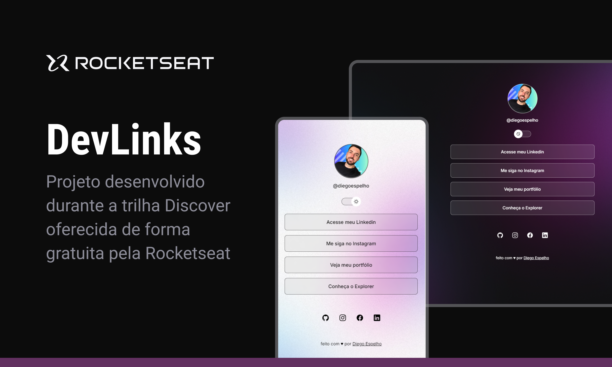

<h1 align="center">DevLinks</h1>

Projeto desenvolvido durante a trilha Discover oferecido de forma gratuita pela Rocketseat.

  <a href="#-tecnologias">Tecnologias</a>&nbsp;&nbsp;&nbsp;|&nbsp;&nbsp;&nbsp;
  <a href="#-projeto">Projeto</a>&nbsp;&nbsp;&nbsp;|&nbsp;&nbsp;&nbsp;
  <a href="#-layout">Layout</a>&nbsp;&nbsp;&nbsp;|&nbsp;&nbsp;&nbsp;
  <a href="#-licença">Licença</a>

  

 

  

## 🚀 Tecnologias

Esse projeto foi desenvolvido com as seguintes tecnologias:

## 💻 Projeto

O DevLinks é um agregador de links para usar como cartão de visitas online.

- [Acesse o projeto finalizado aqui](https://diegoespelho.github.io/discover-rocketseat/)

## 🔖 Layout

O layout desse projeto foi entregue pela própria Rocketseat.

## 📝 Licença

Esse projeto está sob a licença MIT.

